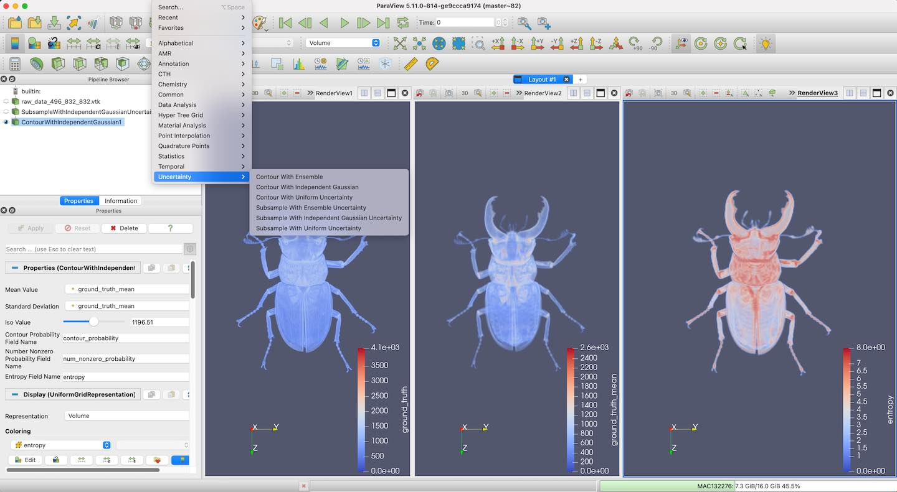

This repo contains some code that use the vtk-m to implement the uncertainty algorithm.

The original name is the UCV, the updated name might be UVM (uncertianty visualizatio based on vkt-m), which might be more make sense.

Related paper:

Wang, Zhe, Tushar M. Athawale, Kenneth Moreland, Jieyang Chen, Chris R. Johnson, and David Pugmire. "FunMC^ 2: A Filter for Uncertainty Visualization of Marching Cubes on Multi-Core Devices." (2023).

### Build

install example on ubuntu machine:

```
clone the repo
$ cd install_scripts
$ /bin/bash ubuntu_cpu.sh 
...
try to add library path by executing:
export LD_LIBRARY_PATH=/home/zw/cworkspace/UCV/install_scripts/ubuntu_cpu/install/vtk-m/lib:${LD_LIBRARY_PATH}]

$ export LD_LIBRARY_PATH=/home/zw/cworkspace/UCV/install_scripts/ubuntu_cpu/install/vtk-m/lib:${LD_LIBRARY_PATH}]
```

### Example of executing by command line


using the uniform distribution

```
$ ./ucv_reduce_umc ../../../../dataset/beetle_496_832_832.vtk ground_truth uni 4 900
```

using the indepednet gaussian distribution

```
$ ./ucv_reduce_umc ../../../../dataset/beetle_496_832_832.vtk ground_truth ig 4 900
```

using the multivariant gaussian distribution (only works for #vertexies=4 currently)

```
$ ./ucv_reduce_umc ../../../../dataset/raw_data_128_208_208.vtk instance mg 4 900
```

### Example of compiling paraview plugin

1 Compiling the paraview

Cloning the ParaView master

the branch we tested ok is:
e9ccca9174658e74d61458ad9a3292d9f6fe2bfa.

Remember to use git submodule to init the third party libraries in an recursive way.

2 Updating associated VTK and vtkm repo

Updating the VTK under the ParaView to the latest version, this version uses the VTKm 2.0, which is used to build and compile the UCV. After checking to the latest VTK version, only the submodule file is updated, the actual VTKm under it is not updated yet. Remember to update that VTKm version to make sure all codes under the repo are actually updated.

The branch we tested ok for VTK is:

488dd57581341ea1d6b584099ae778e89a888cab

3 Compiling the UCV using the ParaView's library

Cloning the code into a new file and compile it based on ParaView library.

4 Running the ParaView and load the plugin

Start the ParaView, and then click Tools->Manage Plugins->Load New then selecting the .so file under the build direactory of UCV such as `ucv/lib/UncertainContour/UncertainContour.so`.

The current ParaView plugin is for the proof of concept and is only work for uncertianty based on hixel data block, we will extend it to support more functionalities.



